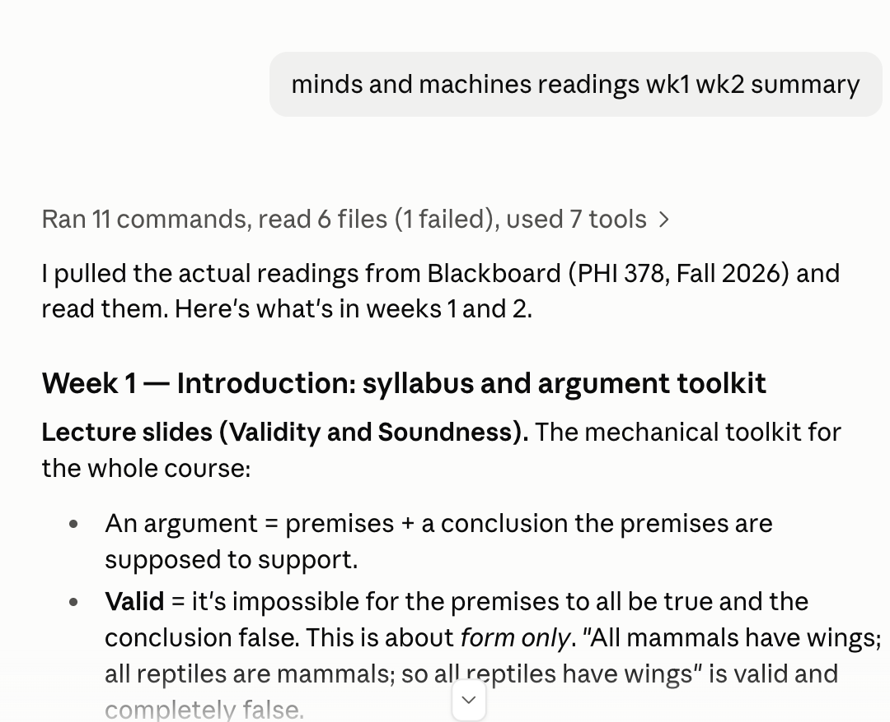

# Blackboard MCP

Ask an AI assistant about your own Blackboard and get real answers: what's due, what your
grades are, what your professors posted, and the files for any assignment. It works with your
own logged-in Blackboard session, so it can only see what you can already see. It is
read-only: it can never submit, post, message, or change anything.

Setup takes about ten minutes and you only do it once. If you have never used a terminal,
just copy and paste each command exactly as written.



## What you need

1. A Mac, or a Windows 10 / 11 PC
2. [Google Chrome](https://www.google.com/chrome/)
3. [Node.js](https://nodejs.org) version 20 or newer (get the LTS installer)
4. An AI app that supports MCP, such as [Claude Desktop](https://claude.ai/download) which is free for all Syracuse Students!

**Opening a terminal.** On a Mac, press Cmd + Space, type "Terminal", press Enter. On Windows,
press the Windows key, type "PowerShell", press Enter.

Not sure if you have Node.js? Type `node -v` and press Enter. If you see `v20` or higher you
are set.

## Setup (do once)

Run these commands, one at a time.

**macOS**

```bash
mkdir -p ~/Documents/GitHub
cd ~/Documents/GitHub
git clone https://github.com/alanwtom/blackboard-mcp.git
cd blackboard-mcp
npm run setup
```

**Windows (PowerShell)**

```powershell
mkdir ~\Documents\GitHub -Force
cd ~\Documents\GitHub
git clone https://github.com/alanwtom/blackboard-mcp.git
cd blackboard-mcp
npm run setup
```

The first line creates the folder if you do not already have one. Do not skip it: if that
folder is missing, the `cd` fails, and the next command quietly downloads the project into
your home folder instead — everything still works, but none of the paths further down this
page will match what you have.

(`npm run setup` shows scrolling text for a minute or two while it downloads what it needs;
that is normal. If your Mac says `git` is not installed, agree to install it, then run the
commands again. On Windows, install [Git for Windows](https://git-scm.com/download/win)
first if `git` is not recognized, then open a new PowerShell window.)

`npm run setup` is a friendly wizard that:

1. Checks you have everything (Node.js, Chrome, the project build)
2. Connects Claude Desktop (and Claude Code) for you, with your permission
3. Checks your Blackboard session and opens a Chrome window to log in if needed
4. Confirms everything works

For the login step, use the Chrome window with the red banner (not your usual Chrome
browser). Sign in with your NetID and approve Duo exactly like usual. Your password and Duo
codes are never seen or saved by this project: that part is always you typing in a real
browser.

When the wizard says everything is ready, quit and reopen your AI app, and you are done.
Prefer doing these steps by hand? The manual way is described at the bottom of this page.

## Use it

Talk to your AI like a person:

- "What's due in the next 7 days?"
- "Any new announcements this week?"
- "What are my grades in Calculus?"
- "Pull up the Essay assignment: instructions and attached files."
- "Download the lecture slides from Week 3."

The first question takes a few seconds, because it has to start a browser and re-check your
session; after that it is quicker still. Downloaded files are saved in
`~/.blackboard-mcp/downloads` on a Mac, or `C:\Users\yourname\.blackboard-mcp\downloads` on
Windows.

## If something goes wrong

| What you see | What to do |
| --- | --- |
| "Blackboard session expired" | Run `npm run login` and sign in again. This is normal after a while. |
| A question fails | Run `npm run status`, then try again. Blackboard has brief hiccups sometimes. |
| "browser profile is already in use" | Something else already has the session open. Close the other terminal, and quit your AI app, before running `npm run login`. |
| Login window confusion | Type your NetID in the window with the red banner. It is a separate private browser, not your usual Chrome. |
| AI shows no Blackboard tools | Quit the AI app completely and reopen it. On Windows, closing the window is not enough: right-click the icon in the system tray and choose Quit. Then re-check the path in the manual steps. |
| A course looks empty | Archived courses are locked by the university. New courses may have nothing posted yet. |
| macOS: still no tools after restarting | Claude Desktop is launched by Finder, which does not always know where `node` lives — most often when Node came from `nvm` or Homebrew rather than the installer from nodejs.org. Run `which node`, then put that full path in place of `"node"` in the config block in the manual steps below. |
| Windows: `npm` is not recognized | Close PowerShell, open it again, and retry. The Node.js installer only reaches new windows. |
| Windows: "running scripts is disabled" | Windows is blocking npm's launcher. Open PowerShell as Administrator once and run: `Set-ExecutionPolicy -Scope CurrentUser RemoteSigned` |

## Safety and privacy

- Read-only by design: this project contains no code that could submit work, post messages,
  or change anything.
- It only sees what you can see, because it uses your own session.
- Your password and Duo codes are never requested, read, or stored.
- Everything stays on your own computer. To erase it all, run `npm run logout`, or delete the
  `.blackboard-mcp` folder in your home folder (`~/.blackboard-mcp` on a Mac,
  `C:\Users\yourname\.blackboard-mcp` on Windows). Never share that folder; it keeps you
  signed in.

## Being a good citizen

Use it for yourself at a human pace, and check your university's acceptable-use policy
before using any automation with your student account. Not affiliated with or endorsed by
Syracuse University or Anthology/Blackboard.

## Manual setup (if you prefer doing it by hand)

<details>
<summary><strong>Click to expand: the manual steps</strong></summary>

1. **Build the project**

```bash
npm install
npm run build
```

2. **Log in to Blackboard**

```bash
npm run login
```

A Chrome window opens with a red banner. Sign in with your NetID and approve Duo there. When
you land back on Blackboard, the window closes by itself.

3. **Check that it worked**

```bash
npm run courses
```

4. **Connect your AI app**

For Claude Desktop: open Settings, then Developer, then Edit Config, and add this block
inside the outer braces.

On macOS the config lives at `~/Library/Application Support/Claude/claude_desktop_config.json`:

```json
"mcpServers": {
  "blackboard": {
    "command": "node",
    "args": ["/Users/yourname/Documents/GitHub/blackboard-mcp/dist/index.js"]
  }
}
```

On Windows it lives at `%APPDATA%\Claude\claude_desktop_config.json`:

```json
"mcpServers": {
  "blackboard": {
    "command": "C:\\Program Files\\nodejs\\node.exe",
    "args": ["C:\\Users\\yourname\\Documents\\GitHub\\blackboard-mcp\\dist\\index.js"]
  }
}
```

Two Windows details matter: **every backslash has to be doubled** (that is how JSON works; a
single backslash makes the file invalid), and giving the full path to `node.exe` avoids the
common case where an app launched from the Start menu cannot find `node` by itself. To print
the two paths you need, run this from the project folder:

```powershell
(Get-Command node).Source; "$PWD\dist\index.js"
```

On macOS, to print both paths, run this from the project folder:

```bash
which node; echo "$PWD/dist/index.js"
```

If Claude Desktop shows no tools even after a full restart, put the `which node` output in
place of `"node"` above: an app opened from Finder does not always inherit the `PATH` your
Terminal has, which is most likely when Node came from `nvm` or Homebrew.

Save the file, quit Claude Desktop completely (Cmd + Q on a Mac; on Windows right-click the
tray icon and choose Quit), and reopen it.

For Claude Code on macOS, run:

```bash
claude mcp add blackboard -- node /path/to/blackboard-mcp/dist/index.js
```

For Claude Code on Windows, run this from the project folder:

```powershell
claude mcp add blackboard -- "$((Get-Command node).Source)" "$PWD\dist\index.js"
```

</details>

## For the technically curious

<details>
<summary><strong>Architecture, configuration, and development notes</strong></summary>

- **Stack**: TypeScript (ESM), Node 20+, Playwright (Chrome channel, dedicated profile),
  MCP TypeScript SDK over stdio, Zod, Vitest.
- **Data access**: Blackboard Learn REST API, called as same-origin requests from a page on
  the Blackboard host, so requests match what the Ultra web app itself sends. Both
  `blackboard.syr.edu` and `blackboard.syracuse.edu` (separate cookie domains) are supported.
- **Session resilience**: Learn's session cookie does not survive a browser restart, so the
  authenticated cookie set is snapshotted to `~/.blackboard-mcp/browser-state.json` (mode
  0600 where the OS honours POSIX modes; on Windows the per-user ACL on `C:\Users\<name>`
  does that job) and restored on launch. While the institution SSO session lasts, the SAML
  entry is followed silently to re-authenticate with no interaction.
- **Endpoints** (verified against Syracuse, Aug 2026): `users/me`,
  `users/{id}/courses?expand=course`, course contents (flat listings with `parentId`; file
  data on `contentHandler.file`), course announcements, `calendars/items`, and the v2
  gradebook (`columns`, `columns/{id}/users/me`; due dates at `grading.due`, points at
  `score.possible`). Paging caps at 100. Attachment downloads follow the item's
  `rel=alternate` `/ultra/redirect` link.
- **Tools**: `list_courses`, `get_course_content`, `get_announcements`, `get_assignments`,
  `get_grades`, `get_attachment`, `get_upcoming_work`, `get_recent_updates`,
  `get_assignment_context`. All read-only. Errors are short coded messages with sensitive
  values masked.
- **Low volume**: TTL caching, a 200 ms delay between pages of the same listing, hard
  request caps, and the shared browser closes after 5 idle minutes. Independent work (one
  course versus another, one gradebook column versus another) runs at most four requests
  deep via `mapWithConcurrency`, so the request *count* is unchanged — they are simply no
  longer queued behind each other. Courses that answer `PERMISSION_DENIED` are remembered
  for 15 minutes, which removes them from later sweeps entirely: past-term enrolments are
  reported as available and only refuse when their contents are asked for, and Blackboard
  publishes no end date to tell them apart beforehand.
- **Configuration**: `BB_BROWSER_CHANNEL`, `BB_HEADLESS=0`, `BLACKBOARD_MCP_HOME`,
  `BB_BASE_URL`, `BB_SSO_ENTRY_URL`, and `BLACKBOARD_HOSTS` in `src/blackboard/hosts.ts`
  for other institutions.
- **Development**: `npm run typecheck`, `npm test` (100 tests, fully mocked), `npm run build`,
  `npm start`, and `npm run discover` (records real Blackboard traffic while you browse, to
  verify endpoints).
- **Platforms**: macOS and Windows 10/11 are both supported; Linux should work but is
  untested. Everything OS-specific lives in `src/platform.ts` (Chrome and Claude Desktop
  locations, PATH lookup, spawning `.cmd` shims). Three Windows behaviours the code handles
  explicitly:
  - Downloaded file names are sanitized to Windows rules on every platform. A Blackboard file
    called `Week 3: Notes.pdf` would otherwise land in an NTFS alternate data stream on a file
    named `Week 3` — reported as a successful download the student can never open.
  - A locked browser profile announces itself differently: Windows Chrome exits with code 21
    and Playwright only sees the control pipe close, so that signature maps to
    `BROWSER_PROFILE_BUSY` alongside the POSIX `SingletonLock` message.
  - `where` lists the extensionless npm shim ahead of the runnable `.cmd`, so PATH lookups
    prefer a PATHEXT match, and `.cmd` shims are spawned through `cmd.exe` with quoted
    arguments (project paths often contain spaces).
- **Compatibility**: built for Syracuse University Blackboard Ultra, Aug 2026. Other schools
  need the configuration above plus small parser checks.

</details>

## License

[MIT](LICENSE). Made for students, by a student.
